<!--
  Multi-Modal Bio-Signal Analyzer README
  Designed for Hackathon, GitHub Portfolio, Research Showcase, and Assistive-Tech Demo
-->

<p align="center">
  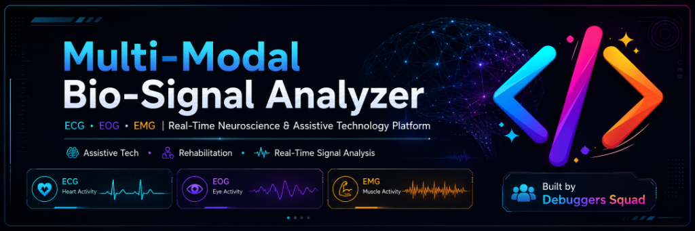
</p>

<h1 align="center"> 🧠 Multi-Modal Bio-Signal Analyzer 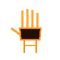</h1>

<h3 align="center">
  ECG • EOG • EMG based Real-Time Neuroscience & Assistive Technology Platform
</h3>

<p align="center">
  <b>Transforming human bio-signals into meaningful actions, rehabilitation insights, emergency support, and accessible human-computer interaction.</b>
</p>

<p align="center">
  
  
  
  
</p>

---

## 🚀 Project Overview

**Multi-Modal Bio-Signal Analyzer** is a real-time neuroscience and assistive technology platform that captures, processes, visualizes, and interprets multiple human body signals such as:

- **ECG** – heart electrical activity  
- **EOG** – eye movement and blink-based control  
- **EMG** – muscle activation and strength analysis  

The project is designed to support **rehabilitation**, **paralysis communication**, **muscle strength monitoring**, **heart signal visualization**, **caregiver support**, and **human-computer interaction**.

This repository combines multiple working modules into one ecosystem:

| Module | Purpose |
|---|---|
| **4-Channel EMG** | Muscle activation, left-right strength comparison, fatigue and rehab analysis |
| **ECG Plotter** | Real-time ECG waveform plotting and report generation |
| **Nurosync (EOG)** | Eye-blink based control and neuroscience interface |
| **ParaTalk (EOG)** | Blink-based communication platform for paralyzed / locked-in patients |

---

## 🧠 Why This Project Matters

Millions of people suffer from conditions where movement or communication becomes difficult due to paralysis, stroke, neuromuscular disorders, injuries, or motor disabilities.

This project explores one powerful idea:

> **If the body can still generate signals, technology can convert them into communication, control, and care.**

With ECG, EOG, and EMG signals, this system can help in:

- Blink-based communication for patients  
- Muscle recovery and rehabilitation tracking  
- Real-time heart signal monitoring  
- Assistive device control  
- Caregiver alerts  
- Research and neuroscience education  
- Low-cost bio-signal experimentation  

---

## ⚡ Core Features

### 👁️ EOG – Eye Blink Control

- Detects eye blinks using EOG signals  
- Converts blinks into digital commands  
- Supports blink-based selection and interaction  
- Useful for paralysis communication and assistive interfaces  

### 💪 EMG – Muscle Strength Analysis

- Captures muscle activation using EMG sensors  
- Supports 4-channel muscle monitoring  
- Compares left vs right muscle strength  
- Helps in rehab progress tracking  
- Can identify fatigue and activation patterns  

### ❤️ ECG – Heart Monitoring

- Real-time ECG waveform plotting  
- Heart signal visualization  
- BPM / pulse-based analysis scope  
- Report generation support  
- Useful for educational and monitoring demonstrations  

### 🗣️ ParaTalk – Blink Based Communication

- Designed for paralyzed or locked-in patients  
- Allows communication through simple eye blinks  
- Includes care mode, normal talk, entertainment, and emergency support  
- Built with modern web technologies  

---

## 🏗️ System Architecture

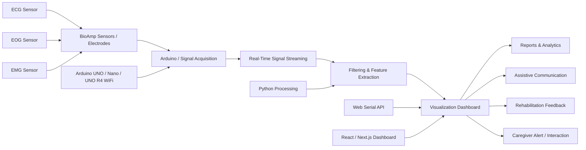

---

## 🔬 Signal Flow

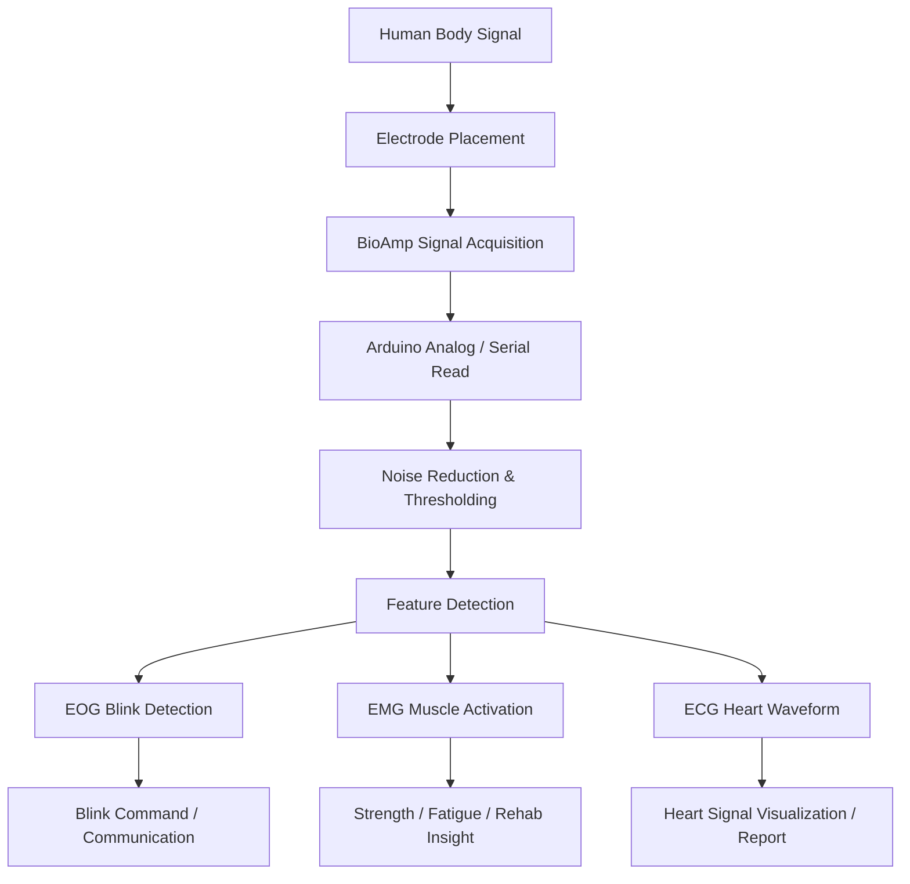

---

## 📁 Repository Structure

```bash
Multi-modal-Bio-Signal-Analyzer-Nuroscience-project-
│
├── 4-Channel EMG/
│   ├── 4-channel muscle signal acquisition
│   ├── wireless / serial plotting
│   ├── muscle activation dashboard
│   └── reports
│
├── ECG_Plotter (ECG)/
│   ├── ECG_Plotter.py
│   ├── ECG reports
│   └── real-time ECG visualization
│
├── Nurosync (EOG)/
│   ├── app/
│   ├── firmware/
│   ├── blink detection logic
│   └── EOG-based control interface
│
└── Para_Talk (EOG)/
    ├── app/
    ├── arduino/
    ├── components/
    ├── hooks/
    ├── WhatsApp / communication support
    └── blink-based assistive dashboard
```

---

## 🛠️ Tech Stack

<p align="center">
  
  
  
  
  
  
</p>

### Hardware

- Arduino UNO / Nano / UNO R4 WiFi  
- BioAmp EXG Pill  
- BioAmp Muscle Sensor / EMG electrodes  
- ECG electrodes  
- EOG electrode placement near eyes  
- Jumper wires, breadboard, USB serial connection  
- Optional OLED / wireless modules depending on module  

### Software

- Python  
- PyQt / plotting tools  
- Arduino IDE  
- React / Next.js  
- Tailwind CSS  
- Framer Motion  
- Web Serial API  
- JavaScript / TypeScript  

---

## 🎯 Module Details

## 1️⃣ 4-Channel EMG – NeuroPulseAI

<p align="center">
  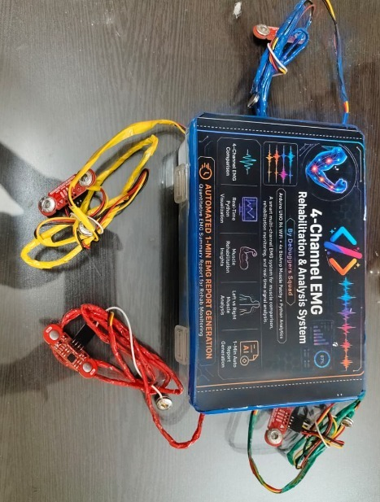
  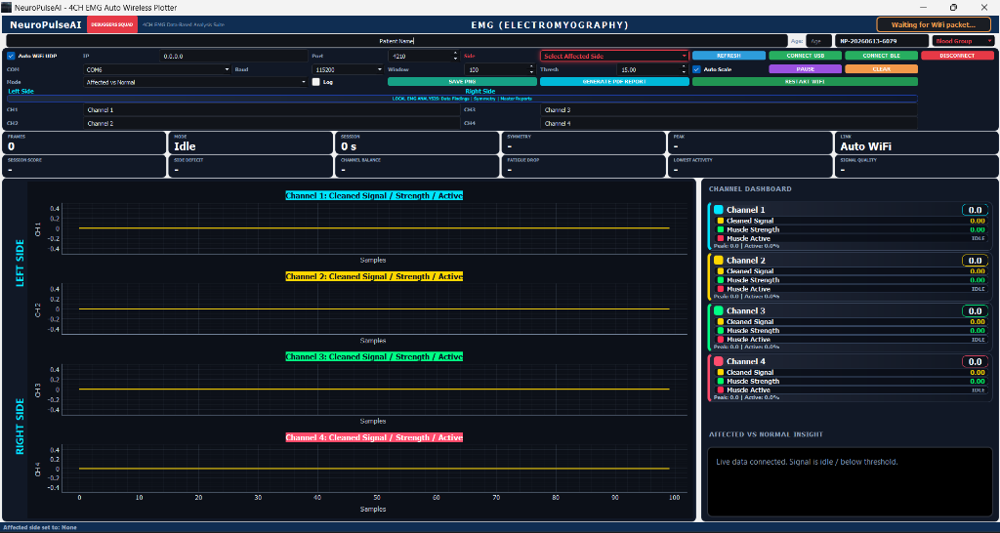
</p>

The 4-channel EMG module captures multiple muscle signals and helps analyze muscle activation patterns.

### Key Capabilities

- 4-channel EMG acquisition  
- Real-time plotting  
- Left vs right muscle comparison  
- Muscle activation strength  
- Fatigue-level estimation  
- Rehabilitation feedback  

### Possible Use Cases

- Physiotherapy support  
- Stroke recovery exercises  
- Sports muscle analysis  
- Prosthetic control research  
- Muscle imbalance detection  

---

## 2️⃣ ECG Plotter

<p align="center">
  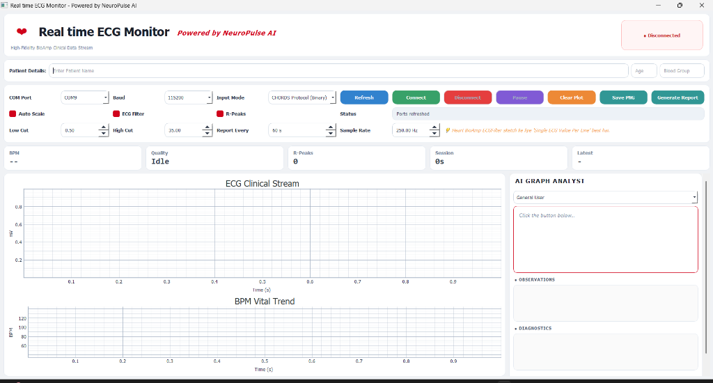
</p>

The ECG module plots heart electrical activity in real-time.

### Key Capabilities

- Live ECG waveform display  
- ECG signal visualization  
- Report generation support  
- Educational heart signal analysis  

### Possible Use Cases

- Biomedical signal learning  
- Heart waveform demonstration  
- Low-cost ECG experimentation  
- Health-tech hackathon prototype  

> ⚠️ This project is for educational and research demonstration purposes only. It is not a certified medical diagnostic device.

---

## 3️⃣ Nurosync – EOG Based Control

<p align="center">
  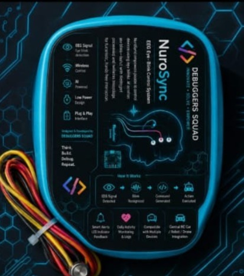
  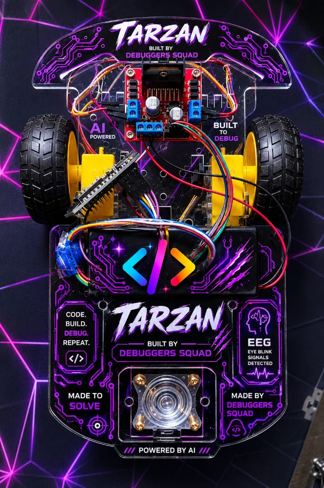
  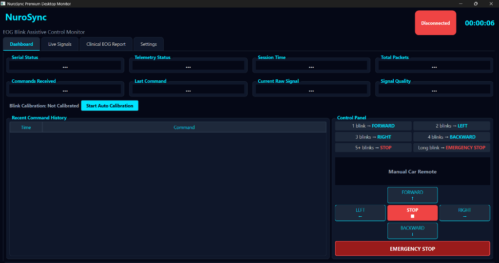
</p>

Nurosync uses EOG signals to detect eye blinks and convert them into control commands.

### Key Capabilities

- EOG signal capture  
- Blink detection  
- One-blink / double-blink control possibilities  
- Human-computer interaction  
- Assistive device interface  

### Possible Use Cases

- Blink-controlled wheelchair interface  
- Blink-to-select UI  
- Smart assistive control  
- Neuroscience education  

---

## 4️⃣ ParaTalk – Blink Based Communication System

<p align="center">
  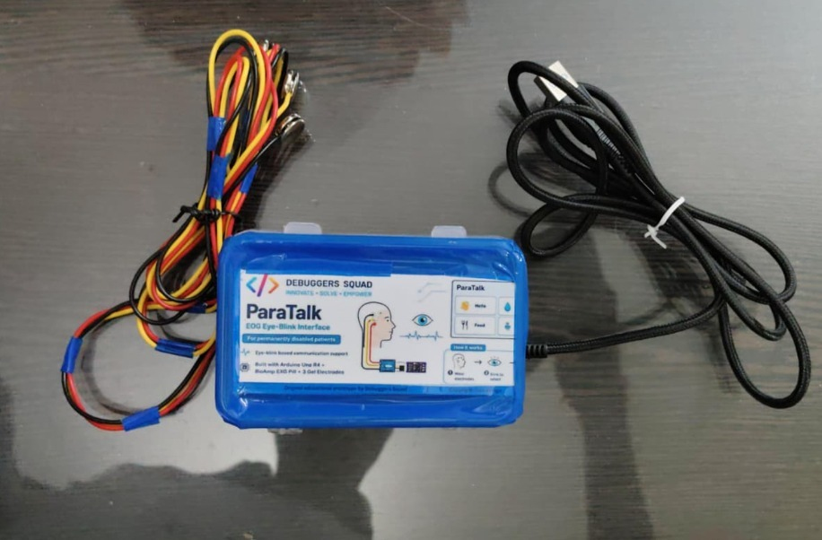
  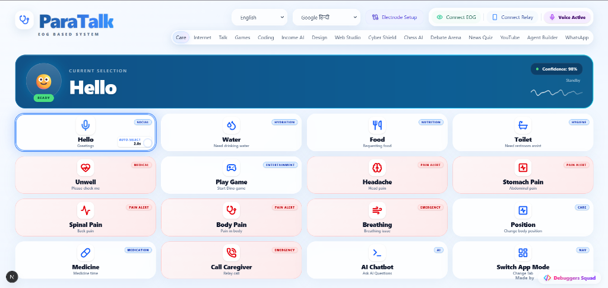
</p>

ParaTalk is a web-based assistive communication platform designed for people with severe motor disabilities.

### Key Capabilities

- Eye-blink based interface control  
- Care mode for emergency or daily needs  
- Normal talk phrase board  
- Entertainment / one-button games  
- Multilingual text-to-speech scope  
- Arduino + Web Serial integration  
- Caregiver alert support  

### Impact

ParaTalk gives a person with limited movement a way to communicate using simple eye blinks.

> **One blink can become a voice.**

---

## 🧩 Complete Platform Vision

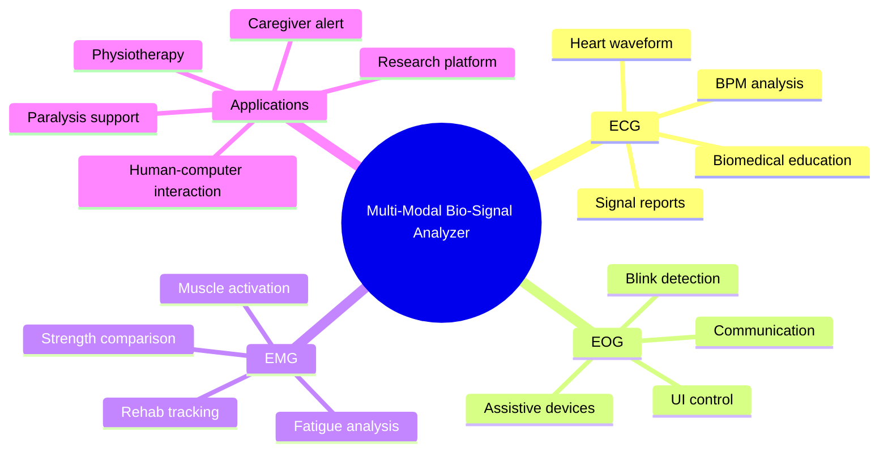

---

## 🖥️ Dashboard Vision

The platform can be expanded into a unified dashboard containing:

- Live ECG graph  
- Live EOG blink graph  
- Live EMG channel graph  
- Blink command status  
- Muscle strength meter  
- Fatigue indicator  
- Report generation  
- Patient / user session logs  
- Caregiver alert button  
- Rehabilitation progress summary  

---

## 🎥 Animation / UI Ideas for Hackathon Demo

To make the project visually powerful during hackathon presentation, the following animations can be added:

### 👁️ EOG Animation

- Eye blink animation  
- Signal spike when blink occurs  
- Blink command card glowing on detection  
- Cursor / selection movement based on blink  

### 💪 EMG Animation

- Muscle fiber glow on activation  
- Strength bar increasing with contraction  
- Left vs right comparison animation  
- Fatigue dots changing color  

### ❤️ ECG Animation

- Moving ECG waveform  
- Heart pulse glow  
- BPM counter animation  
- Report card generation animation  

### 🧠 Neuroscience Theme

- Neural network particles  
- Brain signal flow lines  
- Sensor-to-dashboard animated pipeline  
- Real-time data stream effect  

---

## 🚀 Getting Started

### 1. Clone the Repository

```bash
git clone https://github.com/adityaIITG1/Multi-modal-Bio-Signal-Analyzer-Nuroscience-project-.git
cd Multi-modal-Bio-Signal-Analyzer-Nuroscience-project-
```

---

## ▶️ Running ECG Plotter

```bash
cd "ECG_Plotter (ECG)"
python ECG_Plotter.py
```

Make sure your Arduino is connected and the correct COM port is selected in the script if required.

---

## ▶️ Running 4-Channel EMG

```bash
cd "4-Channel EMG"
python neuropulseai_4ch_fast_plotter.py
```

or use the launcher:

```bash
launch_4ch_plotter.bat
```

---

## ▶️ Running Nurosync EOG

```bash
cd "Nurosync (EOG)"
python main.py
```

or use:

```bash
run_nurosync.bat
```

---

## ▶️ Running ParaTalk

```bash
cd "Para_Talk (EOG)"
npm install
npm run dev
```

Then open:

```bash
http://localhost:3000
```

For Web Serial API support, use a Chromium-based browser such as Chrome or Edge.

---

## 🧪 Electrode Placement Concept

### EOG

- One electrode above the eye  
- One electrode below the eye  
- Reference electrode near mastoid / behind ear  

### EMG

- Two electrodes on target muscle belly  
- Reference electrode on neutral area  
- Place electrodes along the muscle fiber direction  

### ECG

- Electrode placement depends on the ECG lead configuration  
- Keep wires stable to reduce motion artifacts  

---

## 📊 Reports & Analytics

The system can generate or support:

- ECG session reports  
- EMG muscle strength reports  
- Blink detection logs  
- Rehab session summaries  
- Left vs right muscle comparison  
- Fatigue and activation trends  

---

## 🏆 Hackathon Pitch

### Problem

People with paralysis, stroke, neuromuscular disorders, or severe movement limitations often struggle to communicate, control devices, or track recovery.

### Solution

A low-cost multi-modal bio-signal platform that reads ECG, EOG, and EMG signals and converts them into real-time visualizations, commands, reports, and assistive actions.

### Innovation

Unlike a single-signal prototype, this platform combines:

- Eye blink control  
- Muscle strength analysis  
- Heart signal monitoring  
- Assistive communication  
- Rehab feedback  
- Dashboard-ready architecture  

### Impact

This can help in:

- Inclusive healthcare  
- Affordable rehabilitation  
- Assistive communication  
- Caregiver support  
- Biomedical education  
- Human-computer interaction research  

---

## 🌍 Real-World Applications

| Area | Application |
|---|---|
| Paralysis Support | Blink-to-speak and blink-controlled interface |
| Rehabilitation | Muscle strength and recovery tracking |
| Cardiac Education | ECG waveform visualization |
| Assistive Devices | Blink / muscle-based control |
| Caregiver Support | Alerts and need-based communication |
| Research | Low-cost neuroscience experimentation |

---

## 🔮 Future Scope

- AI-based signal classification  
- Automatic artifact removal  
- Cloud dashboard  
- Mobile application  
- Bluetooth / WiFi streaming  
- Patient history tracking  
- Doctor / physiotherapist view  
- Voice assistant integration  
- Wheelchair control  
- Smart home control  
- Medical-grade validation  

---

## ⚠️ Disclaimer

This project is built for **education, research, hackathon demonstration, and assistive technology prototyping**.

It is **not a certified medical device** and should not be used for clinical diagnosis, treatment, or emergency medical decisions without proper medical validation and regulatory approval.

---

## 👨💻 Built By

<p align="center">
  <b>Debuggers Squad</b>
</p>

<p align="center">
  Built with passion for neuroscience, accessibility, rehabilitation, and inclusive technology.
</p>

---

## ⭐ Support

If you like this project, consider giving it a ⭐ on GitHub.

<p align="center">
  <b>“Empowering human potential through real-time bio-signal intelligence.”</b>
</p>
